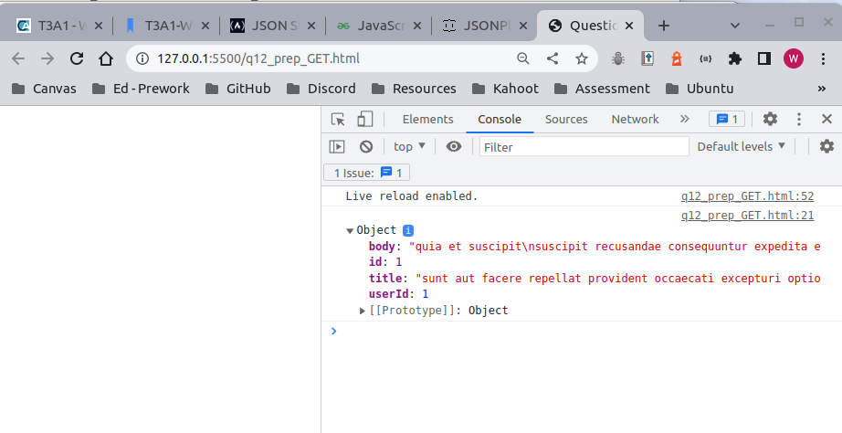
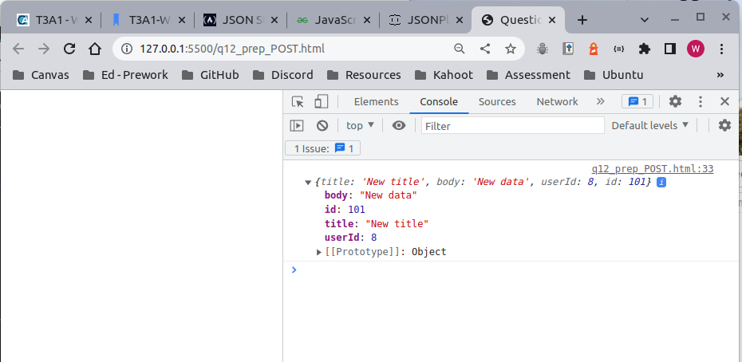

# **T3A1 - Workbook**  
**Name:** Wade Doolan  
**Student number:** 12678  

<hr>   

## **Question 1:**  

*Provide an overview and description of a standard source control process for a large project*  

There are several hosted source control systems available for developers to use; however, this question will be answered using the Git and GitHub source control system as an example. 

### GitHub setup

It's likely a standard source control process for a large project will require a GitHub repository (repo) where all the project code will be housed remotely. This central GitHub repo could be set up within a senior developer's personal GitHub account, but it will probably involve the main repo being set up by the project lead within a company GitHub account (Demasi, 2022).

All developers involved in the project will have their own GitHub accounts. They will be sent an invitation to become a collaborator on the project by the project lead. Once each developer has accepted the invitation they become collaborators on the project repo (Demasi, 2022). An example of the GitHub invitation to collaborate on the project repo is show below:


(GitHub Docs, 2022a)

### Creating project files

The project lead could initially create the starting files (HTML, JavaScript etc.) that will ultimately be worked on by other developers in the main branch of the project GitHub repo (Demasi, 2022). An example of this is shown below:


(Demasi, 2022)

### Creating issues

When the project lead is ready to start allocating tasks to the other developers they can create issues in the GitHub repo. Issues can be read by all developers and allow each developer to read the requirements of the open issues and respond accordingly. Issues make it easy for all team members to know who is working on a particular task. Notably, issues can be used to deal with any aspect of the project, but they are very useful for outlining individual feature requirements for the project (Demasi, 2022).

### Local environments and feature development

All developers will work on their respective issues/features locally. As such, they will require Git to be installed on their local machines. They will set up their local development environments by creating their main project directory and cloning down the project repo from GitHub. For example, ``` git clone git@github.com:<project repo>/<project name>.git  ```. Now the remote repo has been copied down to each developers' local environment (Demasi, 2022).

### General GitHub/Git workflow

In their local environments, each developer must ensure their copy of the main project code is up-to-date before starting on each new feature/issue. While on the main branch, they can do this using a ```git pull``` or other commands like ```git fetch origin``` and ```get reset --hard origin/main``` (Atlassian, 2022a).  

Once their local environment is up-to-date, each developer could follow the source control follow recommended by GitHub when starting on new feature/issue (GitHub Docs, 2022a). These steps are outlined below:

1. Create a new branch and name the branch appropriately, so it's easy to identify the feature or issue being developed. For example, ```git checkout -b new-menu-feature```. 
2. Each developer works on the feature code on their local feature branch, ensuring they commit regularly. For this they can use the following commands: ```git add .```, ```git commit -m "message"```. The feature branch should be pushed to the remote repository on a regular basis, allowing the project lead and other developers to track the progress of the feature/issue branch. All local updates can be pushed to the remote repo using, ```git push -u origin new-menu-feature```.
3. The project lead and other developers might review the commits that have been pushed up to the remote repo feature branch. Changes can then be made locally in response to the ongoing feedback and then pushed back up to the feature branch in GitHub   
4. When a developer has finished working on the feature or issue they commit locally and push to the remote branch. At this point they submit a pull request to merge the new branch onto the main branch. This triggers a review by other developers, including the project lead to review the code before it is merged into the main branch. 
5. A developer then need to address all the feedback provided from the review. When this has been done and the merge request is accepted, the developer will merge the feature or issue branch onto the main branch. This typically involves moving to the main branch, updating the local main branch inline with the remote and then merging the feature/issue branch onto the main branch. The following commands can be used to achieve this.   
    - Move to the main branch:```git checkout main```    
    - update the local version of main inline with the central version: ``` git pull```
    - merge the local feature branch onto local main: ```git pull origin new-menu-feature```
    - pushing all updates back to the central repository: ```git push```  
6. It is recommended by GitHub to delete the feature/issue branch after it has been successfully merged onto the main branch. This is to ensure other developers don't accidentally start using an old branch. Notably, the pull request and commit history for the branch will not be deleted. 

(Atlassian 2022a; GitHub Docs 2022a)

<hr>

## **Question 2:**  

*What are the most important aspects of quality software?*

Quality software can be broadly defined as the extent to which the system meets the needs of the end users. Furthermore, these needs are listed in ISO/IEC 25010 and include the attributes shown below (Iso25000.com, 2022).


(Iso25000.com, 2022)


1. Functional suitability: is an important quality characteristic that represents how well a software product meets the explicit and implicit needs of its users. This quality characteristic has three sub-attributes:
    - *Functional completeness*, which relates to the degree to which the system provides all the functions stipulated by the users.
    - *Functional correctness*, pertains to the ability of the system to produce the correct results with the right amount of precision.
    - *Functional Appropriateness*, is the capacity of the software only run the functions necessary to achieve the tasks required by the users.     

(Iso25000.com 2022; Super User 2022)

Example: 

2. Performance efficiency: relates to the performance of the system relative to the size of the resources used under certain conditions. The quality characteristic it comprised of a number sub-attributes:
    - *Time behaviour* is essentially the time it takes for the system to execute its functions. Faster processing time is typically more desirable.
    - *Use of resources* relates to the amount of resources used by the software product when performing tasks. Minimal use of resources like memory and storage to achieve desired outcomes is desirable.  
    - *Capacity* involves the maximum limit of the product and how well this meets the system requirements.
    
(Iso25000.com 2022; Kaur, Grover and Dixit 2018)

Example: 

3. Compatibility: generally refers to how well a product works with other related products when sharing the same hardware or software environments. This includes two sub-attributes, co-existence and interoperability. Co-existence pertains to how well a product performs while not negatively affecting the other product. Interoperability involves how well two or more products exchange and use the shared information. An example of compatibility is how well a web app works across different browsers and operating systems (Iso25000.com 2022; Software Testing Help 2022)

Example: 

4. Usability: is the extent to which a product can be used by the target audience. This particular quality requirement comprises several key characteristics including a users ability to recognise how appropriate the product is for them, how easy it is to learn to use the product, how easy it is to operate the product, if the product protects the user from making errors, how intuitive the interface is and accessibility for all users. Usability testing typically involves a small set of end-users (Iso25000.com 2022; Guru99 2020b).

Example: 

5. Reliability: involves determining how well a product performs its functions under certain conditions for set period of time. This quality involves assessing how reliable a product is under normal conditions, how available the product is when it is when required for use, if the product can still function when a software or hardware fault occurs and if the product can be recovered successfully after system failure (Iso25000.com, 2022). 

Example: 

6. Security: is perhaps one of the most important quality characteristics of a product. It refers to the extent to which a product ensures appropriate authorised access, code integrity, logging, entity identification and user authentication (Iso25000.com, 2022).  

Example: 

7. Maintainability: relates to the continuous improvement and adaptability of a product. This quality has several sub-characteristics including the extent of modularity that allows component change without drastically impacting other components, reusability of product components across multiple systems, the ability to analyse the effects of change on a product, how easily a product can be modified with causing defects and how easily a product can be tested to ensure it is fit for purpose (Iso25000.com, 2022).     

8. Portability: is the extent to which a product can be transferred from one hardware or software environment to another. This quality comprises: 
    - adaptability or the extent to which a product can adapt to changing hardware and software environments like changes to operating systems or browsers.  
    - How easy it is to install/remove a product from certain environment, such as a Windows operating system.
    - The degree to which can replace another product in the same environment and still perform the same tasks.


<hr>

## **Question 3:**  

*Outline a standard high level structure for a MERN stack application and explain the components*

A MERN stack application is any application built using MongoDb, Express.js, React.js and Node.js. A MERN application comprises three layer or tiers, the front end, back end and a database and works well with JavaScript Object Notation (JSON) data. The use of MongoDB, Express.js, React.js and Node.js allows JSON data to move easily between the database layer and the front end and back again. The architecture for a MERN application is shown in the image and explained in more detail below (MongoDB, 2022).


(MongoDB, 2022)


### The front end - React.js

React.js is a front end framework built using JavaScript and represents the top tier of the application. React allows developers to build a front end interface with reusable components, making development fast and efficient. Moreover, React creates a virtual Document Object Model (DOM) in memory and only alters the parts of a webpage that need to be updated and leaves the rest unchanged. This is in contrast to refreshing an entire page when something changes. With React, you can build complex, interactive interfaces using multiple components, create frontend routes, connect to data via the back layer and render the relevant JSON data in HTML (Reactjs.org 2021a; Reactjs.org 2021b; W3schools.com 2022b).

### The back end server layer - Express.js and Node.js 

Express.js is a server-side framework that works on top of a Node.js server. Express.js allows developers to easily write back end routes that use JavaScript functions to handle incoming HTTP requests and respond accordingly. Express.js connects a React front end, handles the back end routing and connects to a back end MongoDB database using a driver like Mongoosejs. The Mongoosejs driver helps facilitate the movement of JavaScript object/JSON document data between the front end and the MongoDB database with schemas and models.(MongoDB 2022; Mongoosejs.com 2022)

### The database layer - MongoDB

MongoDB is a NoSQL database that stores data in a JSON document structure, which closely resemble JavaScript objects. JSON document/JavaScript object data created in the React front end can be sent to the Express.js/Node.js backend where it's processed and inserted into the MongoDB database. Likewise, JSON data can be queried and rendered and then rendered on the React front end (MongoDB, 2022).       

<hr>

## **Question 4:**  

*A team is about to engage in a project, developing a website for a small business. What knowledge and skills would they need in order to develop the project?*

The project team members would require a combination of technical or hard skills and soft skills. These are discussed in more detail below:

### Technical skills

Technical skills and knowledge:  

- Front end technologies including HTML5, CSS, JavaScript and additional libraries like React.js, JQuery and CSS preprocessors. 
- Knowledge of at least one server side language like Python, Ruby or JavaScript (if using Node.js).
- Knowledge and skills relating several of database management systems like MongoDB or PostgreSQL. The ability to query data is also a must. For example using SQL.
- Design skills relating to user interface / user experience (UI/UX) is essential.
- Some knowledge around severs such as Apache and Linus to handle server administration is helpful.
- Version control skills relating to Git and GitHub (or similar) is very important.
- Knowledge and skills relating to web services and RESTful API creation and consumption.
- It's also import to have some understanding of security, software testing, algorithms and data structures.  

(Guru99, 2020a) 

### Soft skills

Some important soft skills include: 

- Creativity
- Communication skills including active listening and one-on-one communication.
- Adaptability 
- Problem-solving is a must 
- Patients
- Good time management
- Collaboration with other developers

(Indeed Career Guide, 2022)

<hr>

## **Question 5:**  

*With reference to one of your own projects, discuss what knowledge or skills were required to complete your project, and to overcome challenges*  


<hr>

## **Question 6:**  

*With reference to one of your own projects, evaluate how effective your knowledge and skills were for this project, and suggest changes or improvements for future projects of a similar nature*  


<hr>

## **Question 7:**  

*Explain control flow, using an example from the JavaScript programming language*

Control flow is the order in which code is executed by a computer. Without certain structures that can change the control flow, the computer will parse the code from the top line (left to right) to the bottom line of a script. However, the control flow of a program is frequently altered in order to achieve a desired outcome. Conditionals, loops and functions are the main structures used to change the flow of code (Mozilla.org, 2022b). 

Moreover, in JavaScript, block statements (code inside curly brackets ```{ code goes here }```) are used with the control flow statements to encapsulate the code that is executed based on the requirements of the conditional, loop or function. In addition to conditional, loop and function structures, JavaScript also includes structures that alter the control flow based on the detection of an error. The try...catch...finally statement is used to change the order in which code is read based on the detection of an error. This type of statement is typically used in combination with conditionals and functions (Mozilla.org, 2022c).

In JavaScript, function hoisting is another important concept to address when discussing control flow. When a function is declared in JavaScript, it is always read first and loaded into memory before any other code is executed. This means a function can be declared after it is called. Essentially, the control flow is altered to ensure a function is available to be called regardless of where it is declared in a script (JavaScript Tutorial, 2022b).

### Example - conditionals 

As the name suggests, these structures alter a code's control flow based on whether a condition is met or not (Mozilla.org, 2022a). In JavaScript, conditionals can include:
- if...else statements
- switch statements
- Ternary operator  

(Mozilla.org, 2022e)

**Conditional control flow example**: Using the JavaScript example shown below:
1. The script's code is read from the top, with the object added into the variable ```myDetails```. 
2. The if ...else structure is then read, where the condition ```!myDetails.email``` is tested. That is, if there is no email value detected in the object ```myDetails``` (the condition is True), only the ``` console.log("Please enter a valid email")``` is executed and all the other code in the ```else``` section is ignored.
3. However, if an email value is detected in the object ```myDetails``` (the condition is False) then only the ```console.log("Email added successfully")``` is run and the code inside the ```if``` block is ignored. 
4. Essentially, the if ...else statement alters the control flow based on the result of the condition, with the aim of indicating if an email value has been added to the ```myDetails``` object.

(Mozilla.org, 2022e)  

JavaScript if ...else Example:

```js

const myDetails = {
    name: "Wade",
    phone: "1234567892",
    email: null
}

if (!myDetails.email) {
    console.log("Please enter a valid email")
} else {
    console.log("Email added successfully")
}

``` 
<hr>


## **Question 8:**  

*Explain type coercion, using examples from the JavaScript programming language*  

Type coercion is an implied process, where the code will automatically convert a value from one data type to another under certain circumstances (Mozilla.org, 2022f). For example, in JavaScript, a number value will be coerced into a string value when attempting to add a sting and a number together (see below).

**Example: General type coercion in JavaScript**
```js

let num1 = "5";
let num2 = 10;

let total = num1 + num2;

console.log(total)

// Will output 510 as a string

```
Notably, JavaScript is a weakly typed language, meaning the data type of a variable is determined when it is initialised with a value, not at declaration. Furthermore, type coercion in JavaScript occurs to the string, number and boolean primitive types. Importantly, how particular data types are coerced is dependent upon the type of operation being used (Bhalla, 2022).

1. String coercion  

As shown in the example above, a number is typically coerced into string when a number and string are added together. This also happens when a boolean and a string are added together (GeeksforGeeks, 2020b).

 **JavaScript example: coercion to string type**

```js

let num1 = false;
let num2 = "22";

let total = num1 + num2;

console.log(total)

// Will output false22 as a string

```

2. Number coercion

Where possible, JavaScript will coerce a string to a number when operations like subtraction, multiplication, division and modulus are used between a number and string or two strings. If a string cannot be logically coerced into a number ```NaN``` is the result of the operation (GeeksforGeeks, 2020b).

**JavaScript example: coercion to number type**

```js  

let num1 = 25;
let num2 = "5";

let result = num1 / num2;

console.log(result)

// Will output 5 as a number

```
JavaScript will also coerce Boolean values to numbers where appropriate. Since true can be represented a 1 and false as 0, it is logical for JavaScript to convert Boolean values to numeric values (GeeksforGeeks, 2020b). The example below shows how this can happen.

**JavaScript example: coercion to number type**

```js


let num1 = true;
let num2 = false;
let num3 = true;

let result = num1 + num2 + num3;

console.log(result)


// Will output 2 as a number

```

3. The equality operator

When the non-strict equality operator ``` ( == ) ``` is used in JavaScript, non-number values will be coerced into numbers, where appropriate  However, coercion will not occur when the strict equality operator ```( === ) ``` is used (GeeksforGeeks, 2020b). The example below shows how a string "12" is coerced into a number when it is compared to the number 12 using the non-strict equality operator.

**JavaScript example: equality operator**

```js


let num1 = 12;
let num2 = "12";


let result = num1 == num2

console.log(result)


// The output will be true

```

<hr>

## **Question 9:**

*Explain data types, using examples from the JavaScript programming language*

In programming, setting/knowing the type of data a variable holds (data type) is required for a computer to be able to perform operations on variables and solve certain problems. For example, for a computer to be able to multiply values together, it must be able to discern the information being multiplied together are numbers (W3schools.com, 2015b).  

JavaScript is a dynamically typed language meaning the same variable can be used to hold values with different data types. The example below shows how this can happen (W3schools.com 2015b; Mozilla.org 2022d).

```js

let myVar = 25; //myVar has Number data type
myVar = "First Name"; // myVar now has a String data type
myVar = true; // myVar now has a Boolean data type

```

JavaScript has eight basic data types, seven primitive and one non-primitive. A primitive data type in JavaScript is capable of holding only one single data (datum) while the non-primitive type (an Object) can hold collections of data (Programiz.com, 2022). JavaScript primitive types can be tested using the ``` typeof ``` except for the null data type. Null data types must be tested using ```=== null```. This is explained in the code below.  

```js

let a = 'string';
let b = 1;
let c;
let d = true;
let e = null;

console.log(typeof(a)) //outputs string
console.log(typeof(b)) //outputs number
console.log(typeof(c)) //output undefined   
console.log(typeof(d)) //outputs boolean
console.log(typeof(e)) //outputs object
console.log(e === null) //outputs true

```
### Examples of data types in JavaScript

The following are some examples of data types in JavaScript and what they're typically used for.  

- **Boolean type:** (primitive) A boolean type in JavaScript can hold two possibles values: true and false. This data type is typically used in situations that require a binary choice such as conditionals, for example, if...else or ternary operators.

- **Number type:** (primitive) A number type in JavaScript is able to hold integers and floating-point number values; however, there is a limit on the size of the number that can be stored. For example, JavaScript can hold a floating point number as a number type between $ \pm (2^{-1074} \text{ to } 2^{1024})$. And if a value is larger/smaller than the capacity it is converted to a default value. For example, if a positive value gets any larger than the size limit it is automatically converted to infinity. A number type is usually used for mathematical or counting operations. For example, a number type variable is used to count the number of iterations a for loop is required to perform. For example, ``` for(let i = 0; i < arr.length; i++) {Do something here...} ```, with i in this example a number data type used to count the number of iterations.

- **String type:** (primitive) A string type in JavaScript is used to hold text, with strings declared as words wrapped in inverted commas or back ticks (for string interpolation). For example, ``` let a = "string" ``` is the same as ``` let a = 'string' ```, which is the same as ``` let a = `string` ``` in that they all declare the variable ```a``` as a string data type. Importantly, each character in a string has an index position, allowing easy access to individual characters within string. For example, ``` let a = "string" console.log(a[0])``` will output the letter at index 0, in this case "s". 

(Mozilla.org 2022d; Programiz.com 2022)


<hr>  

## **Question 10:**

*Explain how arrays can be manipulated in JavaScript, using examples from the JavaScript programming language*  

In JavaScript, arrays are a special type of Oject that can hold a collection of values, which can be saved under a single name (W3schools.com, 2015a). For example, 
```js 
const names = ["Tom", "Andrew", "Jenny", "Peter"]
``` 
In terms of simple array manipulation, array elements are indexed starting at zero, which allows elements to be accessed, added or changed easily using square bracke notation (W3schools.com, 2015a). The example below shows how an array can be easily manipulated using index values:

```js  
const names = ["Tom", "Andrew", "Jenny", "Peter"]

//accessing an element at index[0]
console.log(names[1]) //outputs "Andrew"

//adding an element at index[4]
names[4]= "Alicia"
console.log(names) //outputs [ 'Tom', 'Andrew', 'Jenny', 'Peter', 'Alicia' ]

// changing an element value at index[0]
names[0] = "Rebecca"
console.log(names) //outputs [ 'Rebecca', 'Andrew', 'Jenny', 'Peter', 'Alicia' ]

```
Like most Objects in JavaScript, arrays come with properties and methods that can be used to manipulate arrays. In relation to array properties, the ```arr.length``` property can be used in structures like ```for ``` loops to iteratively access and manipulate an arrays elements (W3schools.com, 2015a).
 
```js

const names = ["Tom", "Andrew", "Jenny", "Peter"]

//using the length property to manipulate an array
for(let i = 0; i < names.length; i++) { 

    // add 'Hello my name is: ' to the front of each element
    names[i] = `Hello my name is: ${names[i]}`
}

console.log(names)

// outputs: [
//   'Hello my name is: Tom',
//   'Hello my name is: Andrew',
//   'Hello my name is: Jenny',
//   'Hello my name is: Peter'
// ]

```

However, JavaScript arrays also have an extensive list of methods that make array manipulation even easier. There are many array methods available in JavaScript, and it is outside the scope of this question to explore all of them. However, some of the more common array methods include ```join()```, ```push()```, ```pop()```, ```shift()```, ```unshift()```, ```map()``` and ```reduce()``` (Bolaji Ayodeji, 2019). An examples of each of these methods is shown below:

```js

const names = ["Tom", "Andrew", "Jenny", "Peter"]

// join()

// Join all the elements of an array into a single string based on a delimiter.
let allNames = names.join(" ")
console.log(allNames)
// outputs "Tom Andrew Jenny Peter" as a single string


// push()

// Push one or more elements onto the back of an array
names.push("Alex", "John")
console.log(names)
// outputs the names array with the names "Alex" and "John" added to the end of the array:
// [ 'Tom', 'Andrew', 'Jenny', 'Peter', 'Alex', 'John' ]


// pop()

// remove the last element from the back of an array
names.pop()
console.log(names)
// outputs the names array with "John" removed form the end of the array:
// [ 'Tom', 'Andrew', 'Jenny', 'Peter', 'Alex' ]


// shift()

// Remove the first element from the front of an array
names.shift()
console.log(names)
// outputs the names array with the first name removed from the array:
// [ 'Andrew', 'Jenny', 'Peter', 'Alex' ]


// unshift()

// Adds a new alement to the fron of an array
names.unshift("Tom")
console.log(names)
// outputs the names array with the name "Andrew" inserted at the front of the array.
//  [ 'Tom', 'Andrew', 'Jenny', 'Peter', 'Alex' ]


// map()

// builds a new array by manipulating the elements of another array.

let i = 1
const newNames = names.map(name => {

    let newName = `${name}_${i}`
    i++;
    return newName
})

console.log(newNames)
// outputs a new array (newNames), with each element including their position suffix.
// [ 'Tom_1', 'Andrew_2', 'Jenny_3', 'Peter_4', 'Alex_5' ]


// reduce()

// The reduce method can be used to calculate a single value from an array (e.g. a total value) from the elements in a numeric array 

salesData = [20, 40, 100, 300, 27, 86, 90, 578]

let totalSales = salesData.reduce((accumulatedValue, currentValue) => {
    return accumulatedValue + currentValue
}, 0)

console.log(totalSales)

// outputs 1241 

```
(Bolaji Ayodeji 2019; W3schools.com 2015a)


<hr>

## **Question 11:**

*Explain how objects can be manipulated in JavaScript, using examples from the JavaScript programming language* 

In JavaScript, Objects are variables that contain a collection of values, with each value written as key:value pair. Notably, these key:value pairs are known as properties (W3schools.com, 2015c).

###  Creating objects

Objects can be declared in several ways by either 'object literal' syntax or using 'object constructor' syntax (Md. Abu Talha, 2018). Examples of several approaches are show below:

```js
//Object literal
const employee = {};

employee["firstname"] = "Tom";
employee["lastename"] = "Anderson";
employee["email"] = "t@2.com";
employee["phone"] = "0451236987";


console.log(employee)
// outputs {
//     firstname: 'Tom',
//     lastename: 'Anderson',
//     email: 't@2.com',
//     phone: '0451236987'
//   }

// ------------------------------------------------

// Object constructor

const employee = new Object();


employee.firstname = "Tom";
employee.lastename = "Anderson";
employee.email = "t@2.com";
employee.phone = "0451236987";


console.log(employee)
// outputs {
//     firstname: 'Tom',
//     lastename: 'Anderson',
//     email: 't@2.com',
//     phone: '0451236987'
//   }

// ------------------------------------------------


// Constructor function

function Employee(firstname, lastname, email, phone) {
    this.firstname = firstname
    this.lastname = lastname
    this.email = email
    this.phone = phone
}

let employee1 = new Employee("Tom", "Anderson", "t@2.com", "0451236987")

console.log(employee1)

// outputs 
// Employee {
//     firstname: 'Tom',
//     lastname: 'Anderson',
//     email: 't@2.com',
//     phone: '0451236987'
//   }
  
```

(Md. Abu Talha, 2018)
### Accessing, updating and deleting object properties

The properties within a JavaScript object can be accessed, altered or deleted using either bracket ```object[keyname]``` or dot ```object.keyname``` notation. The examples below show how object properties can be access, changed and deleted using both methods (Md. Abu Talha 2018; W3schools.com 2015c; W3schools.com 2022a).

```js

// Using the employee1 object from the above example

// Accessing an object property value 

console.log(`${employee1.firstname}'s phone number is ${employee1.phone}`)

// outputs Tom's phone number is 0451236987


// Changing an object property value

employee1["email"] = "tom@3.com";

console.log(`${employee1["firstname"]}'s new email address is ${employee1["email"]}`)

// outputs Tom's new email address is tom@3.com

// Deleting an object property

delete employee1.email

console.log(employee1)

// outputs Employee {
//   firstname: 'Tom',
//   lastname: 'Anderson',
//   phone: '0451236987'
// }

```
(Md. Abu Talha 2018; W3schools.com 2015c; W3schools.com 2022a)

### Merging objects

JavaScript objects can be merged by either using the spread operator ``` ...object``` or the ```object.assign()``` method (Md. Abu Talha, 2018). See examples below.

```js

// Merging two objects using the spread operator

const vehicle1 = {
    make: "Audi",
    model: "A4",
    body: "Sedan"
}

const vehicleColour = {
    colour:"Black"
}

const vehicleMerged = {
    ...vehicle1,
    ...vehicleColour
}

console.log(vehicleMerged)
// outputs { make: 'Audi', model: 'A4', body: 'Sedan', colour: 'Black' }


// Merging two objects using the Object.assign() method

const vehicle1 = {
    make: "Audi",
    model: "A4",
    body: "Sedan"
}

const vehicleColour = {
    colour:"Black"
}

const vehicleMerged = Object.assign(vehicle1, vehicleColour)
console.log(vehicleMerged)
// outputs { make: 'Audi', model: 'A4', body: 'Sedan', colour: 'Black' }

```
(Md. Abu Talha, 2018)

### Object keys, values and entries

JavaScript objects can also be manipulated by accessing their keys, values or entries (keys and values) and converting them into arrays. This is done using the ```Object.keys()```, ```Object.values()```, or the ```Object.entries()``` methods. The examples below show how these methods can be used (Md. Abu Talha, 2018).

```js

const vehicle1 = {
    make: "Audi",
    model: "A4",
    body: "Sedan",
    colour: "Black"
}

// Accessing an object's keys

const vehicle1Keys = Object.keys(vehicle1)
console.log(vehicle1Keys)
// outputs [ 'make', 'model', 'body', 'colour' ]


// Accessing an object's values

const vehicle1Value = Object.values(vehicle1)
console.log(vehicle1Value)
// outputs [ 'Audi', 'A4', 'Sedan', 'Black' ]

// Accessing an object's entries - producing a 2 dimensional array

const vehicle1Entries = Object.entries(vehicle1)
console.log(vehicle1Entries)
// outputs [[ 'make', 'Audi' ],[ 'model', 'A4' ],[ 'body', 'Sedan' ],[ 'colour', 'Black' ]]

```
(Md. Abu Talha, 2018).  

### Adding object methods

JavaScript also allow bespoke methods to be added to objects. See the example below (W3schools.com, 2015c).

```js

const customer1 = {
    firstname: "Kelly",
    lastname: "Clarkson",
    email: "k@C.com",
    phone: "1234567891",
    hello: function() {
        return `Hi, my name is ${this.firstname} ${this.lastname}`
    }
}

console.log(customer1.hello())
// outputs "Hi, my name is Kelly Clarkson"

```
(W3schools.com, 2015c)

<hr>

## **Question 12:**

*Explain how JSON can be manipulated in JavaScript, using examples from the JavaScript programming language*  

JSON (JavaScript Object Notation) is a popular way to format data. A JSON object is similar to an object literal in JavaScript, with data structured in key value pairs wrapped in curly brackets. However, there are a number of key differences between JSON and JavaScript objects. JSON is essentially just a string or text written in a form that resembles a JavaScript object. Also, JSON keys must always be wrapped in double quotation marks, ```"firstname"```. Whereas, object literals in JavaScript do not require the keys to be wrapped in quotation marks unless a key is hyphenated ``` 'first-name' ``` (Koishigawa, 2021). The example below shows the difference between JSON and a JavaScript object:

**JSON**

```json 
{
    "name": "Wade",
    "phone": "1234567891",
    "email": "wade@example.com" 
}
```
**JavaScript object**

```js
{
    name: "Wade",
    phone: "1234567891",
    email: "wade@example.com" 
}

```
(Koishigawa, 2021)

Therefore, to be able to manipulate JSON in JavaScript the JSON information must first be parsed/changed into something that JavaScript can understand. This can be done using the ```fetch``` method. The ```fetch``` method can be used to GET data from a source (API) and post data to an API endpoint. 

**Example: using fetch to GET JSON data**

The code below shows how fetch is used in a browser to access JSON data from an external source and convert the data into a JavaScript object. Once JSON data has been parsed to a JavaScript object it can be manipulated like any other JavaScript object.

```html
<!DOCTYPE html>
<html lang="en">

<head>
    <meta charset="UTF-8">
    <meta http-equiv="X-UA-Compatible" content="IE=edge">
    <meta name="viewport" content="width=device-width, initial-scale=1.0">
    <title>Question 12 | JSON GET example </title>
</head>

<body>

    <script>
        // Access an api that returns JSON data. The fetch method acts as a GET request when only the api url is passed.
        let response = fetch("https://jsonplaceholder.typicode.com/posts/1");

        //the fetch method returns a promise object, which uses the .then method to access the data. 

        // The res.json() method is called to parse the JSON data into a JavaScript object literal. In this case an array of objects is returned. The next .then logs the first object to the browser console.
        response.then(res =>
            res.json().then(data => { console.log(data) }))
    </script>

</body>

</html>
```
(GeeksforGeeks 2020a; Typicode.com 2022)

The results of the GET request above are shown in the image below.



**Example: using fetch to POST JSON data**

```html

<!DOCTYPE html>
<html lang="en">
<head>
    <meta charset="UTF-8">
    <meta http-equiv="X-UA-Compatible" content="IE=edge">
    <meta name="viewport" content="width=device-width, initial-scale=1.0">
    <title>Question 12 | JSON POST example</title>
</head>
<body>

    <script>
        // create new information to post to existing JSON data
        let newData = {
            title: "New title",
            body: "New data",
            userId: 8
        }

        // set the options for the fetch method.
        let fetchOptions = {
            method: "POST",
            headers: {
                'Content-Type': 'application/json'
            },
            body: JSON.stringify(newData) //the JSON.stringify method converts the JavaScript object literal into a JSON string.
        }

        //post new info to the existing JSON data and then log the post into the console.
        let response = fetch("https://jsonplaceholder.typicode.com/posts", fetchOptions)
        .then((res) => res.json())
        .then((data) => console.log(data))

    </script>
    
</body>
</html>
```
(GeeksforGeeks 2020a; Typicode.com 2022)

The results of the POST request above are shown in the image below.



<hr>

## **Question 13:**

*For the code snippet provided below, write comments for each line of code to explain its functionality. In your comments you must demonstrates your ability to recognise and identify functions, ranges and classes* 


```js


class Car { // This is a class declaration for a Car class. This syntax was introduced in ES6
    constructor(brand) {  //This constructor method is called during object instantiation and will initialise the object properties. In this case it accepts one argument, the brand of the car.   
      this.carname = brand; //this line of code takes the brand of the car passed during object instantiation and assigns the value to the property "carname".
    }
    present() { //present() is a method of the Car class. it is available to any object instantiated using the Car class.
      return 'I have a ' + this.carname; //when the present() method is called it will return a string "I have a <carname>", where the carname is the brand of the car used to instantiate the object. This is made available to any object instantiated using the Car class.
    }
  }
  
  class Model extends Car { //this is a class declaration for a Model class that is a subclass of the Car class. The extends keyword is used to create the Model class that represents a child of the Car class and allows the Model class to inherit from the parent (Car) class.
    constructor(brand, mod) { //This constructor method is called during object instantiation. Again it initialises the object properties. In this case it accepts two argument, the brand of the car and the car model. 
      super(brand); //the super method calls the constructor of the Car class to access the carname property and assign the brand name passed as an argument through the Model constructor method.
      this.model = mod; //this takes the model of the car passed during object instantiation from the Model subclass and assigns the value to the property "model".
    }
    show() { // show() is a method of the Model subclass. it is available to any object instantiated using the Car class.
      return this.present() + ', it was made in ' + this.model; //the show() method accesses the present() method inherited from the parent Car class, which returns the string "I have a <carname>". This is then concatenated with the string "it was made in <model>" and returns the full string. 
    }
  }
  
  let makes = ["Ford", "Holden", "Toyota"] //This is an array literal where the array of values "Ford", "Holden" and "Toyota" is assigned to the variable makes. 
  let models = Array.from(new Array(40), (x,i) => i + 1980) //In this line an array of numbers between 1980 and 2019 is created and assigned to the variable models.The array is created using the Array.from() method, which takes two arguments, in this case. The first argument (new Array(40)) creates an array with 40 undefinded elements. The second argument is an anonymous callback function that maps over the 40 elements created in the first argument and populates the array with numbers starting at 1980 for element[0] to 2019 for element[39]. The callback function works by accepting two argument (x,i) where x is the element and i is the index of the element value. It returns a value for each element x, which is the the index value + the number 1980. 
  
  //this function is used by the code below. It accepts two arguments (min,max) and returns a randomly generated number between the min and max values, inclusive.  
  function randomIntFromInterval(min,max) { // min and max included
      return Math.floor(Math.random()*(max-min+1)+min); //The inner function Math.randon() generates a random number between 0 and 0.99999. This is then multiplied by (max-min+1)+min, which will retrun a decimal number except when the Math.random() generates zero; in that case the min value is returned as a full integer. Any other number generated results in a decimal value, which is then "floored" thanks to the Math.floor() function wrapped around the inner code. Ultimately, the function returns an integer between the min and max values passed to the function, inclusive. 
  }
  

  for (model of models) { //this is the beginning of a for loop that will loop through all 40 elements in the models array generated above. Essentially, the for loop will iterate 40 times.
  
    make = makes[randomIntFromInterval(0,makes.length-1)] //This line of code calls the randomIntFromInterval function above and passes the min value of zero and the max value of 2, the length of the makes array above minus 1. The randomIntFromInterval function will return a randomly generated number between 0 and 2, which is used to access the element at the index position of the random number in the makes array above. This value is then assigned to the variable make. This occurs for each iteration of the for loop (40 times).
    model = models[randomIntFromInterval(0,makes.length-1)] //This line of code calls the randomIntFromInterval function above and passes the min value of zero and the max value of 2, the length of the makes array above minus 1. The randomIntFromInterval function will return a randomly generated number between 0 and 2, which is used to access the element at the index position of the random number in the models array above. This value is then assigned to the variable model. This occurs for each iteration of the for loop (40 times).
  
    mycar = new Model(make, model); //This line of code instantiates a new object from the Model class and assigns it to the variable mycar. It passess the make and the model from the code above to the constructor method of the Model class. This occurs 40 times, each iteration of the for loop. That is, 40 objects are created using the Model class, which inherits certain information from the parent Car class.

    console.log(mycar.show()) //This line of code uses the show() method available to the mycar object when it was instantiated above. This is then logged to the console. Ultimately, the for loop will console.log the output 40 times, with a combination of "I have a (Ford or Toyota or Holden), it was made in (1980 or 1981 or 1982)". The output will depend on the randonly generated numbers obtained from the randomIntFromInterval function above. 
  }

```
(Eagles 2020; GeeksforGeeks 2018; JavaScript Tutorial 2022a)

<hr>


## References  


